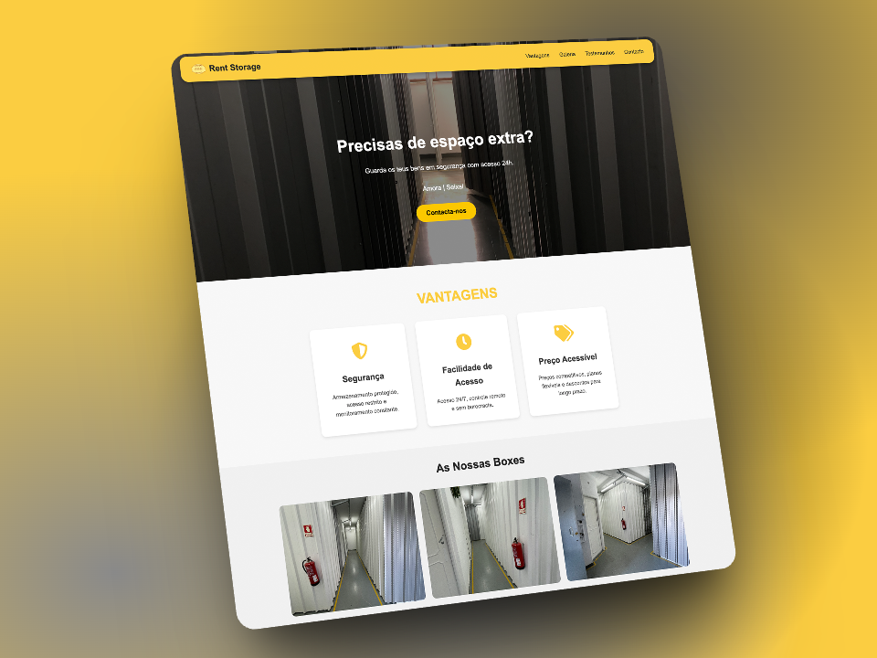

# Rent Storage Website

[](https://rentstorage.pt)
[](https://github.com/diogocaeiro02/rentstorageweb)
[](https://github.com/diogocaeiro02/rentstorageweb)

> A simple, responsive landing page for **Rent Storage** — offering safe, secure storage units with 24-hour access in **Amora** and **Seixal**.

## 📸 Preview



---

## 🌍 Live Preview

🔗 [View Website](https://rentstorage.pt)

---

## 📄 Project Overview

This project is a static website built using:

- **HTML5**
- **CSS3**
- **JavaScript**
- **SwiperJS** (for responsive image slider)

### Key Features:

- Full-screen **Hero Section** with background image
- Animated **scroll effects**
- **Responsive design** for desktop, tablet, and mobile
- **CTA button** leading to the contactscri
- **Lazy loading** optimization (suggested improvement)
- Clean **tab icon (favicon)** setup

---

## 📂 Folder Structure

```
/public
    │
    ├── assets/
    │      ├── image-1.jpeg      (Hero background image)
    │      ├── other images...   (Gallery images)
    │      └── favicon.ico           (Tab icon)
    │
    ├── index.html
    ├── style.css
    ├── script.js
    └── README.md
```

---

## 🚀 How to Run Locally

1. **Clone** the repository:
   ```bash
   git clone https://github.com/diogocaeiro02/rentStorageWeb
   ```
2. **Navigate** into the project directory.
3. **Open** the `index.html` file directly in your browser.

No frameworks, servers, or installations needed.

---

## ⚙️ Technologies Used

- HTML5
- CSS3 (Media Queries + Animations)
- JavaScript
- SwiperJS (CDN)

---

## 🎯 Future Improvements (Ideas)

- Add a **contact form** (Formspree, EmailJS, etc.)
- Further optimize images with **lazy loading** or **blur-up loading**
- Integrate **Google Maps** for location display
- Add **SEO meta tags** (Open Graph for Facebook, Twitter Cards)
- Implement **AOS.js** for better scroll animations

---

## 🛠️ Credits

- Developed by [Diogo Caeiro](https://diogocaeiro.pt)  
- SwiperJS used under MIT License.

---

## 📜 License

This project is proprietary and was developed exclusively for a client.  
Unauthorized copying, modification, or distribution is not permitted without explicit permission.

---
